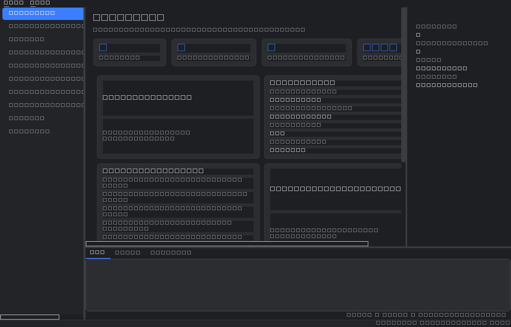
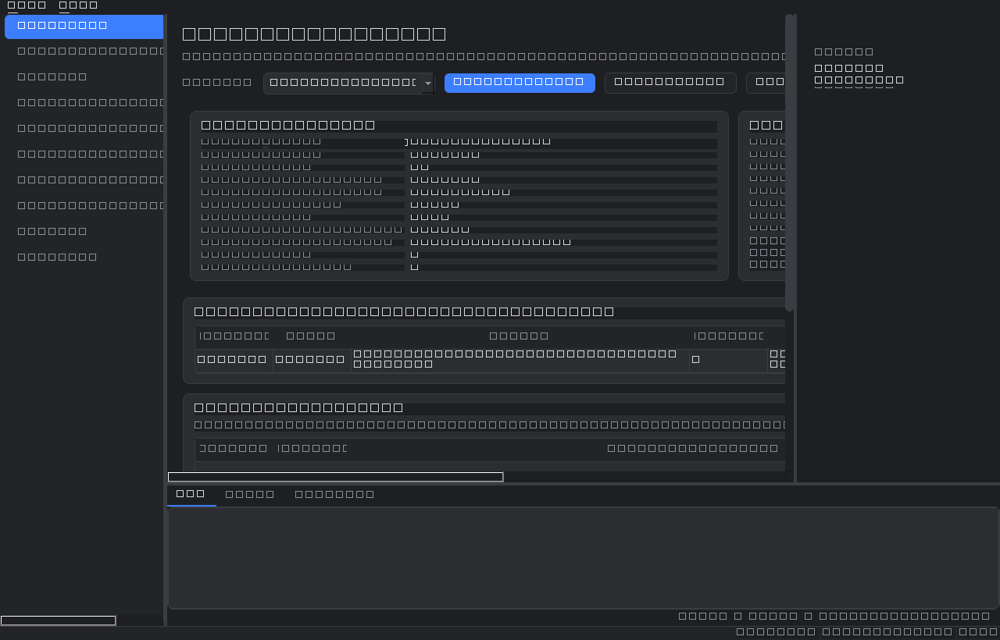
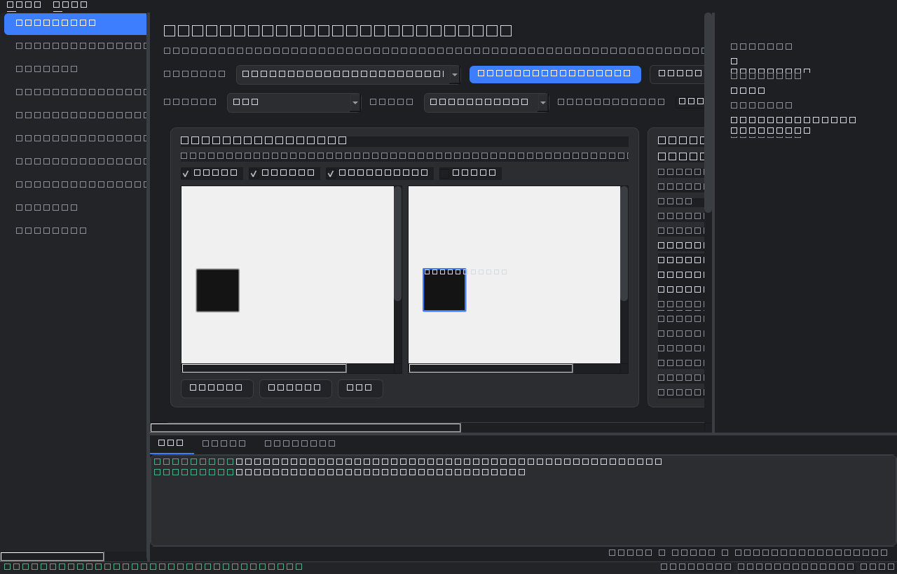
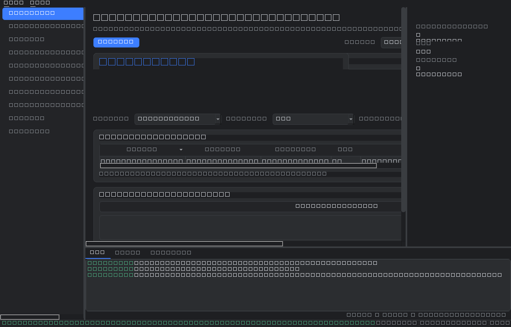

<div align="center">

# 🛠️ AutoDataForge

### An Agentic AI platform for intelligent dataset engineering

*Specialized AI agents collaborate to automatically **plan**, **optimize**, **execute**, **verify**, **remember**, and **export** high-quality AI datasets — driven by a goal, not a hardcoded pipeline.*

[](https://github.com/Prasadslaxmi08/autodataforge/actions/workflows/ci.yml)
[](https://www.python.org/)
[](LICENSE)
[](https://github.com/astral-sh/ruff)
[](https://modelcontextprotocol.io)

[Overview](#overview) · [Features](#-key-features) · [Architecture](#-architecture) · [Quick Start](#-quick-start) · [MCP](#-mcp-integration) · [Roadmap](ROADMAP.md)

</div>

---

## Overview

**AutoDataForge is not another annotation tool — it's an agentic AI system for building datasets.**

You state a goal in plain language ("Create a vehicle-detection dataset from this
traffic video"). A team of specialized agents takes it from there: a **Planner** designs
the pipeline, a **Decision** agent tunes it against real data and past experience, an
**Execution** agent runs it, a **Verifier** judges every annotation, a **Memory** agent
remembers what worked, and an **Exporter** ships a validated dataset. A deterministic
**Task Orchestrator** coordinates the whole run with a single human-approval gate.

The agents cooperate through a **goal-driven workflow** — they reason about *how* to
build the dataset instead of following a fixed script. Every agent drives a **frozen
backend** through a tool interface; no agent reimplements pipeline, storage, or export
logic. And a core rule runs through the entire system: **if a metric can't be measured,
it's reported as *unavailable* — never fabricated.**

Everything is also exposed over the **Model Context Protocol (MCP)**, so any MCP client
(Claude, Cursor, VS Code) can build datasets by calling AutoDataForge's tools directly.

> **Humans review datasets. Agents create them.**

---

## ✨ Key Features

- 🧠 **Multi-agent architecture** — Planner, Decision, Execution, and Memory agents
  coordinated by a deterministic Task Orchestrator.
- 🎯 **Goal-driven, not hardcoded** — describe the outcome; the agents plan the path.
- 🔌 **MCP-native** — the full platform is available as Model Context Protocol tools.
- 🖼️ **Vision pipeline** — import → detect → segment → verify → export, powered by
  Ultralytics YOLO with a dependency-free classical fallback.
- 🎬 **Video ingestion** — probe, choose a frame strategy, deduplicate, and feed the
  same pipeline; a video becomes a standard image dataset.
- 🧾 **Self-verifying** — every annotation gets a reproducible verdict; uncertain samples
  are triaged to a human.
- 📚 **Engineering Memory** — deterministic, versioned, explainable long-term memory
  (no vector DB required) that makes each run smarter than the last.
- 🖥️ **Desktop app** — a PySide6 GUI with dashboards, an annotation editor, and
  verification/intelligence/operations workspaces.
- 🧪 **Production-grade engineering** — strict typing (`mypy --strict`), Ruff, a real
  test suite, and CI on every push.
- 🚫 **No fabricated metrics** — unmeasurable values are surfaced honestly as
  *unavailable*.

---

## 🏗️ Architecture

AutoDataForge layers a **goal-driven agent system** on top of a **frozen deterministic
backend**. Agents orchestrate; the backend does the work.

```
┌──────────────────────────────────────────────────────────────────────────┐
│  Clients:   Desktop GUI  ·  CLI  ·  REST API  ·  MCP Client (Claude/IDE)   │
└───────────────────────────────────┬──────────────────────────────────────┘
                                     │  goal + params
                                     ▼
┌──────────────────────────────────────────────────────────────────────────┐
│                          TASK ORCHESTRATOR                                 │
│      deterministic state machine · event stream · one approval gate       │
│                                                                            │
│   ┌──────────┐   ┌──────────┐   ┌──────────┐   ┌──────────┐               │
│   │ PLANNER  │──▶│ DECISION │──▶│ EXECUTION│──▶│  MEMORY  │               │
│   │  agent   │   │  agent   │   │  agent   │   │  agent   │               │
│   └──────────┘   └──────────┘   └──────────┘   └──────────┘               │
│   goal→plan      tune params    run the plan   recall + record            │
│                                                                            │
│   Planning ─▶ Memory ─▶ Decision ─▶ [APPROVAL] ─▶ Execution ─▶ Save ─▶ ✓  │
└───────────────────────────────────┬──────────────────────────────────────┘
                                     │  tool calls (never reimplemented)
                                     ▼
┌──────────────────────────────────────────────────────────────────────────┐
│                     FROZEN BACKEND  (BackendController)                    │
│   ingest · engine (detect/segment) · quality/verify · snapshot · export   │
│   models (YOLO / classical) · store (SQLite + CAS) · Engineering Memory    │
└──────────────────────────────────────────────────────────────────────────┘
```

**Design principles**

- **Dependencies point downward only.** Clients → orchestrator → agents → backend.
- **The backend is frozen.** Agents wrap it as tools via a `ToolRegistry`; they never
  duplicate its logic.
- **Fully serializable state.** A run can be persisted and resumed from its state alone.
- **Explainable by construction.** Every plan step and verdict carries a reason.

📖 Deep dive: [`docs/AGENT_ARCHITECTURE.md`](docs/AGENT_ARCHITECTURE.md) ·
[`docs/TASK_ORCHESTRATOR.md`](docs/TASK_ORCHESTRATOR.md) ·
[`docs/MCP_SERVER.md`](docs/MCP_SERVER.md)

---

## 🤖 The Agents

| Agent | Role | What it does |
|-------|------|--------------|
| **Planner Agent** | *Strategy* | Turns a goal into an explainable, serializable `ExecutionPlan` — task classification, ordered steps, model/confidence/frame-strategy choices, size & review estimates. |
| **Decision Agent** | *Optimization* | Refines the plan's parameters (confidence, IoU, sampling, batch size, device, export format) using real dataset metadata and history the Planner never saw. |
| **Execution Agent** | *Runtime* | Runs the approved plan by invoking backend tools; tracks progress, pauses at approval gates, retries recoverable failures, and reports results. |
| **Memory Agent** | *Experience* | Before a run, recalls similar past projects and the settings that worked; after a run, records validated engineering knowledge. |
| **Task Orchestrator** | *Coordination* | The single entry point. Walks the state machine (Planning → Memory → Decision → Approval → Execution → Save), streams events, and enforces the failure policy. |
| **MCP Server** | *Interface* | Exposes the whole platform as Model Context Protocol tools for any MCP client. |

### Agent workflow

1. A client submits a **goal** to the Task Orchestrator.
2. The **Planner** produces an `ExecutionPlan`.
3. The **Memory** agent recalls similar past runs and folds in what worked.
4. The **Decision** agent optimizes the plan's parameters against real metadata.
5. The run **parks at a human-approval gate** — nothing heavy executes silently.
6. On approval, the **Execution** agent runs the pipeline through backend tools.
7. The **Memory** agent records the outcome; the orchestrator emits a final report.

---

## 📸 Screenshots

> Screenshots of the AutoDataForge desktop application. Regenerate with
> `python scripts/gui_screenshots.py`.

| Dashboard | Planner Workspace |
|-----------|-------------------|
|  |  |

| Verification Workspace | Operations Center |
|------------------------|-------------------|
|  |  |

<!-- Add product/hero screenshots or a demo GIF here for the GitHub landing page. -->

---

## 🧰 Technology Stack

| Layer | Technology |
|-------|-----------|
| **Language** | Python 3.11+ |
| **Agents & orchestration** | Custom deterministic agent framework (provider-agnostic) |
| **LLM providers** | Anthropic · OpenAI · Ollama · Echo (offline) |
| **Vision models** | Ultralytics YOLO (detect + segment) · classical builtin fallback |
| **Data models** | Pydantic v2 (fully typed, serializable contracts) |
| **API** | FastAPI + Uvicorn |
| **CLI** | Typer |
| **Desktop GUI** | PySide6 (Qt) |
| **Storage** | SQLite + content-addressable store (CAS); optional Postgres + pgvector |
| **Integration** | Model Context Protocol (MCP) |
| **Quality** | Ruff · mypy (strict) · pytest · Hypothesis · GitHub Actions |

---

## 🚀 Quick Start

### Prerequisites

- Python **3.11+**
- (Optional) an NVIDIA GPU for faster YOLO inference

### Installation

```bash
git clone https://github.com/Prasadslaxmi08/autodataforge.git
cd autodataforge

python -m venv .venv
source .venv/bin/activate          # Windows: .venv\Scripts\activate

pip install -e ".[dev]"            # core + dev tools
# optional extras:
pip install -e ".[gui]"           # desktop app
pip install -e ".[detect]"        # real Ultralytics YOLO detector
pip install -e ".[mcp]"           # MCP stdio server
```

### Build your first dataset

```bash
# Run the full pipeline on a folder of images → a validated COCO dataset
autodataforge run ./sample_data --format coco --dest export --name demo

# Launch the desktop application (requires the [gui] extra)
autodataforge-studio            # or: autodataforge gui

# Other commands
autodataforge config-check      # load + validate configuration
autodataforge serve             # FastAPI app (/health, /info)
autodataforge worker            # background job worker
```

> `adf` is a short alias for `autodataforge`. The default detector is a CPU-only
> classical backend (no weight downloads), so the pipeline runs anywhere. Switch to
> real YOLO with one config line:

```bash
VDS_MODELS__DETECTOR=vds.models.adapters.yolo:YoloAdapter autodataforge run ./sample_data
```

---

## 🔗 MCP Integration

AutoDataForge ships a **Model Context Protocol server** so any MCP client can build and
manage datasets by calling tools directly — no custom glue code.

**Exposed tools:** `create_dataset` · `review_dataset` · `export_dataset` ·
`generate_report` · `search_memory` · `list_projects` · `load_project` ·
`resume_task` · `cancel_task` · `task_status` · `health`

Every tool routes through the **Task Orchestrator** — the same planning, decision,
execution, and memory path as the GUI and CLI. Nothing is duplicated.

Example client configuration (e.g. Claude Desktop / Cursor):

```json
{
  "mcpServers": {
    "autodataforge": {
      "command": "autodataforge-mcp",
      "args": []
    }
  }
}
```

📖 Details: [`docs/MCP_SERVER.md`](docs/MCP_SERVER.md)

---

## 📦 Supported Formats & Models

### Dataset export formats

| Format | Status |
|--------|--------|
| **COCO** (JSON) | ✅ Supported |
| **YOLO** (txt) | ✅ Supported |
| Pascal VOC / CVAT / Label Studio | 🔜 Planned ([roadmap](ROADMAP.md)) |

### AI models

| Capability | Options |
|-----------|---------|
| **Detection** | Ultralytics YOLO (`yolo11n/s/m`, custom `.pt`) · classical builtin (offline) |
| **Segmentation** | Ultralytics YOLO-seg |
| **Verification** | Deterministic rule-based verifier · optional VLM verifier |
| **LLM (agents)** | Anthropic · OpenAI · Ollama · Echo (offline) — selected by config |

Models are **plugins** resolved from configuration by import path — swap one with a
single config line, no code change.

---

## 🗂️ Project Structure

```
autodataforge/
├── vds/                     # Python package (import name kept stable)
│   ├── core/                # contracts, enums, errors  (L0)
│   ├── config/              # configuration              (L0)
│   ├── models/              # model protocols + adapters (YOLO, classical) (L1)
│   ├── store/               # SQLite + content-addressable store          (L1)
│   ├── ingest/              # image/video import                          (L2)
│   ├── engine/              # detection + segmentation                    (L2)
│   ├── quality/             # verification                                (L2)
│   ├── curation/ snapshot/  # dataset curation + versioned snapshots      (L2)
│   ├── export/              # COCO / YOLO writers                         (L2)
│   ├── agents/              # LLM agent framework (Planner, Analyst, ...)  (L3)
│   ├── v2/                  # goal-driven agents + Task Orchestrator       (L3)
│   ├── mcp/                 # MCP server (core + stdio transport)          (L4)
│   ├── api/  cli/  sdk/     # REST API, CLI, Python SDK                    (L4)
│   └── gui/                 # PySide6 desktop application                  (L4)
├── docs/                    # architecture + component documentation
├── scripts/                 # evaluation & benchmarking scripts
├── sample_data/             # small demo image set for the quick start
├── tests/                   # test suite
├── pyproject.toml
└── README.md
```

📚 Component docs live in [`docs/`](docs/) — architecture, planner, decision,
execution, memory, orchestrator, MCP server, detection engine, and the desktop GUI.

---

## 🗺️ Roadmap

See [**ROADMAP.md**](ROADMAP.md) for what's shipped and what's next — confidence-preserving
exports, active learning, more export formats, multi-GPU execution, and dataset lineage.

---

## 🤝 Contributing

Contributions are welcome! Please read [**CONTRIBUTING.md**](CONTRIBUTING.md) for the dev
setup, the architecture ground rules, and the quality bar (Ruff + mypy + pytest). By
participating you agree to our [Code of Conduct](CODE_OF_CONDUCT.md).

Good first areas: new export formats, model adapters, docs, and tests.

---

## 🔒 Security

Found a vulnerability? Please report it privately — see [SECURITY.md](SECURITY.md).

---

## 📄 License

Released under the [MIT License](LICENSE) © 2026 EON Space Labs.

<div align="center">

**AutoDataForge** — forge better datasets, automatically.

</div>
