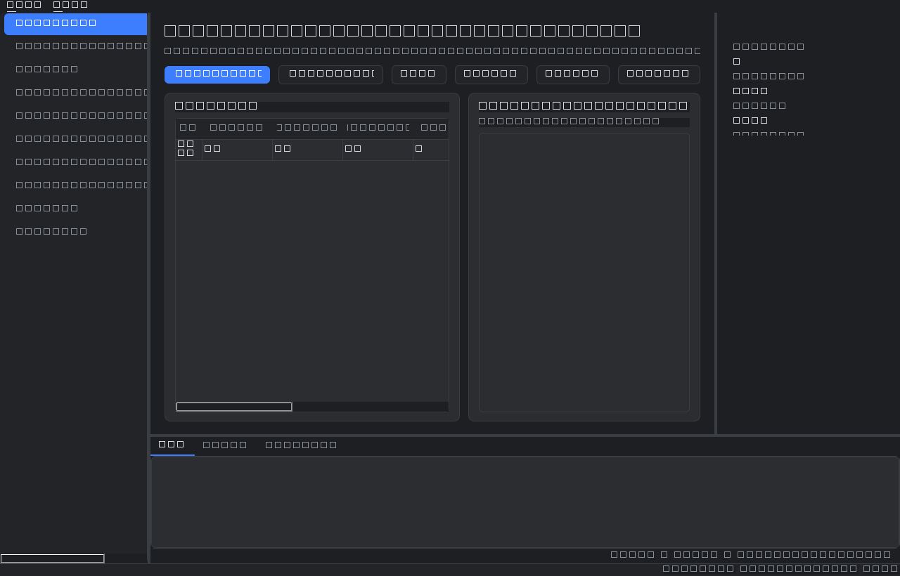
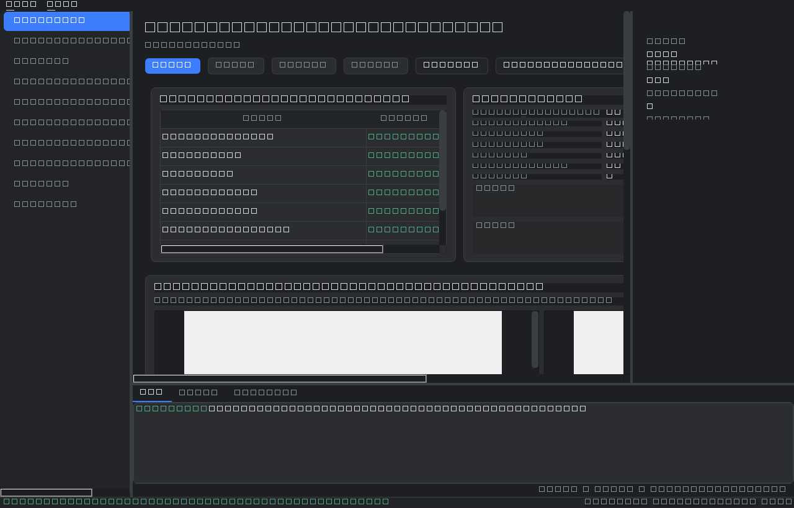
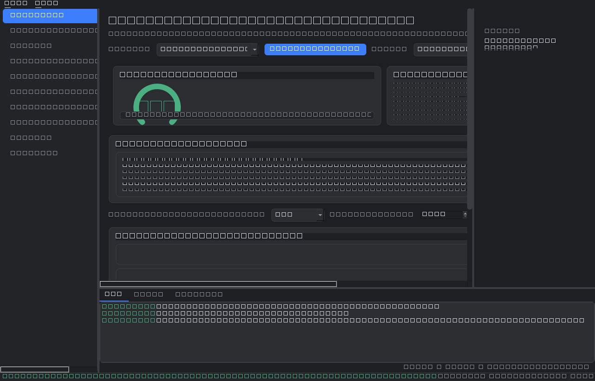
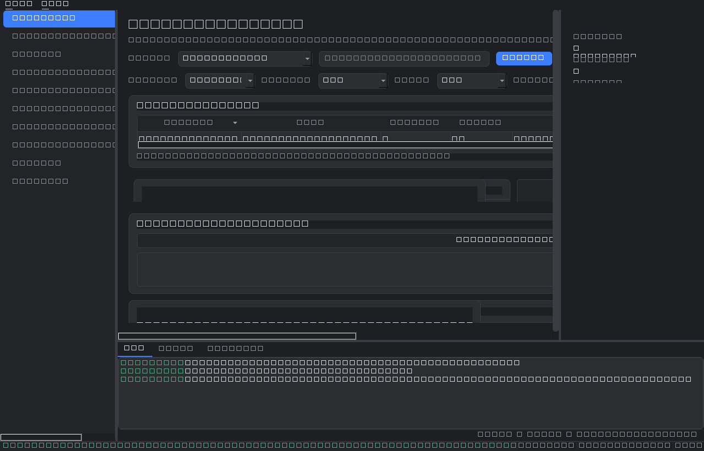
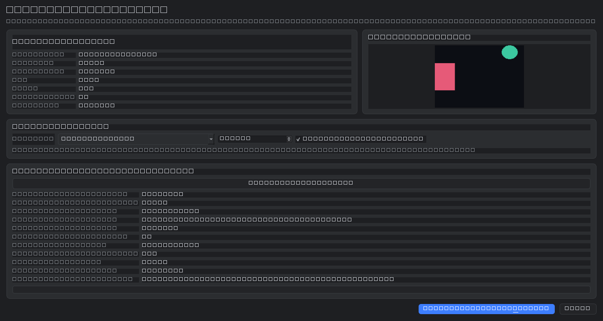
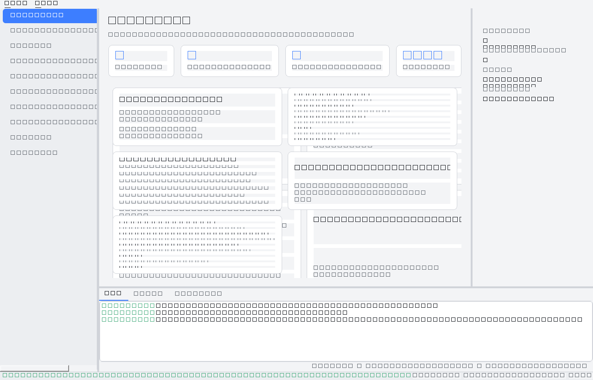

# Desktop GUI Foundation (Phase 11)

A **PySide6** desktop application that becomes the primary interface to the Vision
Dataset Studio platform. It **consumes** the existing backend through a single
seam and duplicates no business logic — strict UI/backend separation, built to feel
like an engineering tool (Qt Creator / VS Code / JetBrains), not a demo.

## Architecture

The UI talks to the backend **only** through `BackendController`, which wraps the
existing `Container`. No Qt types cross into the backend; no backend logic is
reimplemented in the UI.

```
                        ┌──────────────────────── MainWindow (App Shell) ───────────────────────┐
                        │  NavigationPanel │        Workspace (QStackedWidget)      │ Context     │
                        │  (left sidebar)  │  Dashboard · Dataset Manager · 8 more  │ Sidebar     │
                        │                  ├────────────────────────────────────────┴─(right)────┤
                        │                  │        BottomPanel (Log / Tasks / Problems + CPU/MEM/GPU) │
                        └──────────────────┴──────────────────────────────────────────┬───────────┘
                                                                                  StatusBar
   Managers (cross-cutting):  ThemeManager · GuiSettings · ThreadManager · NotificationSystem · ResourceMonitor
                                                     │
                                                     ▼  (the ONLY backend seam)
                                            ┌──────────────────┐
                                            │ BackendController │  plain data in/out, no Qt
                                            └────────┬─────────┘
                                                     ▼
        Container ─▶ pipeline · projects/images/annotations repos · cas · memory · settings
```

Data-flow rules:
- **Long-running work** (dataset import runs the whole pipeline) executes on a
  `ThreadManager` worker; results return via Qt signals. The UI thread never blocks.
- **Notifications** are emitted through `NotificationSystem` and routed by the shell
  to the status bar (transient) and bottom log panel (persistent).
- **Pages** never reference each other or the backend directly — only their injected
  `controller` / `threads` / `notifications`.

## Modules

| Module | File |
|--------|------|
| Application Shell | `vds/gui/main_window.py` |
| Backend Controller | `vds/gui/controller.py` |
| Thread Manager | `vds/gui/threads.py` |
| Theme Manager | `vds/gui/theme.py` |
| Settings (persistence + window restore) | `vds/gui/settings.py` |
| Notification System | `vds/gui/notifications.py` |
| Navigation Panel | `vds/gui/widgets/navigation.py` |
| Context Sidebar | `vds/gui/widgets/right_sidebar.py` |
| Bottom Panel (log/tasks/problems/resources) | `vds/gui/widgets/bottom_panel.py` |
| Status Bar | `vds/gui/widgets/status_bar.py` |
| Resource Monitor | `vds/gui/widgets/resources.py` |
| Pages | `vds/gui/pages/` |

## Pages

**Functional now:** Dashboard, Dataset Manager, the **Planner Workspace** (Phase 12),
the **Annotation Pipeline Workspace** (Phase 13), the **AI Verification Workspace**
(Phase 14), the **AI Dataset Intelligence Workspace** (Phase 15 — the "AI Dataset
Analyst" page), the **Knowledge Center** (Phase 16 — the "Engineering Memory" page),
and the **Operations & Performance Center** (Phase 17 — the "Benchmark Center" page).
The **Dataset Manager** is now an **Import Workspace** that also ingests **video files**
(Phase 17.5, below). **Placeholder layouts** (integrated in later phases): Reports,
Settings.

## Planner Workspace (Phase 12)

The Planner page is the platform's central AI decision-support interface. It shows
**only** what the existing Planner Agent and Engineering Memory produce (via
`BackendController` → `vds/gui/planner_view.py`); it reimplements no planning logic.

Four panels:
1. **Dataset Summary** — name, size, image count, average resolution, class
   distribution, small-object %, duplicate %, estimated difficulty, fingerprint,
   import date, version (all measured).
2. **AI Planning** — every Planner decision (detector, segmentation, confidence,
   batch, workers, GPU strategy, tiling, export, runtime/GPU/review estimates) with
   its reason, confidence, expected impact, trade-offs, and validation status.
3. **Engineering Memory** — the Planner's automatic recall: similar datasets,
   similarity score, previous strategy/review-rate/runtime/benchmark/analyst
   recommendation, and a clear "influenced / no historical match" indicator.
4. **Plan Evaluation** — predicted runtime, throughput, review rate, quality, GPU
   utilization, cost (if a cloud provider is set), Planner confidence, warnings, risks.

**Interactive controls** let the engineer change detector, segmentation, confidence,
batch size, worker count, and export format, then **re-run only the Planner** (never
annotation) to produce an updated `ProcessingPlan`. **Plan Comparison** highlights
every difference (runtime / review / GPU / quality / confidence deltas) between the
original AI plan and the modified plan. Actions: **Generate Plan**, **Accept Plan**,
**Restore AI Recommendation**, **Run Annotation Pipeline** (which calls only the
existing backend pipeline). Long Planner calls run on a worker thread.

## Annotation Pipeline Workspace (Phase 13)

Real-time monitoring of pipeline execution (`vds/gui/pipeline_view.py` derives all
data through `BackendController`). The existing `Phase1Pipeline.run()` is monolithic
and exposes no live hooks, so it runs **unchanged** on a worker thread while the page
provides observability:

1. **Execution Timeline** — the eight stages (Dataset Import → Validation → Detection
   → Segmentation → Verification → Quality Analysis → Engineering Memory Update →
   Export) with status, duration, items processed, and progress. Per-stage detail is
   rendered from the real `ExecutionReport` when the pipeline reports it; the
   Engineering-Memory stage is honestly marked *Skipped* (Phase1Pipeline doesn't write
   a memory record — that's the Analyst's job).
2. **Live Image Preview** — original vs annotated side by side, with bounding boxes,
   labels, and confidence drawn over the real CAS images; zoom / fit / navigate.
3. **AI Model Activity** — detection, segmentation, verification, quality, and
   engineering-memory activity from the measured results.
4. **Live Metrics** — images/sec, latency, GPU/CPU/RAM, elapsed, throughput, export
   count, failed/skipped/duplicates, plus rolling CPU/RAM sparklines (QPainter, no
   chart dependency). CPU/RAM and elapsed update live on a UI timer during the run.
5. **Processing Console** — timestamped events with severity filter, search,
   auto-scroll, copy, and save.

**Controls:** Start, Pause, Resume, Cancel (rolls back the created dataset via the
existing delete path), Restart, Open Output Folder, Export Dataset, Generate Report
(via the existing reporting infrastructure). Because the backend pipeline is atomic,
**Pause/Resume freeze the live monitoring view, not backend execution** — made
explicit in the UI. The **Pipeline Summary** (execution time, totals, avg stage
times, review rate, planner strategy, memory influence, real Analyst summary, export
stats) exports to Markdown or PDF (rendered by Qt from the reporting markdown).

## AI Verification Workspace (Phase 14)

Explains *why* each object was accepted, flagged, or rejected. It **visualizes**
verification — it never performs it: the pipeline stores annotation *states* but not
verdict objects, so `vds/gui/verification_view.py` reproduces each verdict by calling
the existing `RuleBasedVerifier` (deterministic → identical result), all through
`BackendController`.

Five areas:
1. **Image Inspection** — original vs verification overlay side by side, with box /
   label / confidence toggles, zoom / fit, and image metadata (name, resolution,
   dataset position).
2. **Verification Results** — every object: id, class, detection confidence,
   colour-coded verification status (Verified / Needs Review / Rejected / Uncertain),
   verification confidence, suggested action.
3. **AI Evidence** — for the selected object: summary, reason, evidence, risk,
   recommendation, and a **star evidence visualization** (verification confidence,
   detection confidence, evidence quality, geometry consistency, context consistency,
   historical agreement). **Every star is computed from a measured backend output**
   (confidence, geometry validity, neighbour IoU, mask, memory similarity); anything
   unmeasurable is shown as *unavailable*, never invented.
4. **Historical Comparison** — queries Engineering Memory: similar datasets,
   similarity, historical verification, past corrections, analyst notes, agreement
   rate, previous decision, with a clear influenced / no-match indicator.
5. **Verification Statistics** — verified / rejected / needs-review counts, average
   verification & detection confidence, agreement / disagreement rate, review %, and
   verification runtime (reported *unavailable* — not persisted per dataset).

**Filtering & search** by status, class, min detection/verification confidence,
image, and label. **Human-review actions** (Approve / Reject / Mark for Review /
Accept Detection / Reject Detection) go through the existing annotation **state
machine** (illegal transitions are refused). The **Verification Timeline** shows
Detection → Verification → Recommendation → Human Review → Final Decision (timestamps
reported *unavailable* — the backend does not persist them). A verification report
exports to Markdown.

## AI Dataset Intelligence Workspace (Phase 15)

The **AI Dataset Analyst** page turns a completed run into a decision. It **summarizes
existing intelligence** — it does not generate new intelligence. Clicking **Analyze
Dataset** runs the *existing* AI Dataset Analyst (`LLMAnalyst`) over the
`ExecutionReport` the pipeline already produced (the GUI caches that report as JSON
beside the CAS root when a run finishes), off the UI thread. Every displayed value
comes from a measured metric or a validated Analyst recommendation; anything the
backend can't supply is labelled *unavailable*, never fabricated.

Six sections:

1. **Executive Summary** — a **health gauge** (0–100, red→amber→green), dataset
   name/version/size/image-count, annotation quality, verification confidence,
   production readiness, the Analyst's executive summary, and the overall
   recommendation.
2. **Dataset Health Dashboard** — measured KPIs (annotation quality, verification
   agreement, duplicate rate, review rate, detection/segmentation quality, export
   success) as scored bars; overall health is their mean. Unmeasured KPIs (planner
   confidence) show *unavailable*.
3. **Root Cause Analysis** — cards derived from the Analyst's own evidence pack:
   description, measured evidence, impact, recommendation, expected improvement, and
   confidence.
4. **Prioritized Recommendations** — the Analyst's recommendations ranked by
   confidence into HIGH / MEDIUM / LOW cards (problem, expected gain, effort,
   rationale). Filter by priority, minimum confidence, and free-text search.
5. **Historical Comparison** — Engineering-Memory trends (throughput, review-rate,
   quality) as sparklines plus a similar-datasets table. Each analysis records its
   validated knowledge back to memory (dedup-safe), so history grows across runs.
6. **Dataset Readiness** — Ready-for-Training / Requires-Human-Review /
   Requires-Re-Annotation / Requires-Verification / Requires-Additional-Data, each a
   ✓/✗ with the measured metrics that decided it.

**Export** the Executive Summary, Engineering Report, Recommendations, Dataset Health
Report, or full intelligence to **Markdown or PDF** (PDF via Qt from the same
Markdown) using the existing reporting path.

## Knowledge Center (Phase 16)

The **Engineering Memory** page is a searchable engineering knowledge base built
entirely from **Engineering Memory** — it **visualizes** stored knowledge, never
generates it. Every value is a measured metric or a validated Analyst recommendation
read through `BackendController`; when no matching knowledge exists, the page says so.

Six sections:

1. **Knowledge Search** — search stored records by Dataset Name, Scene Type, Object
   Class, Resolution, Planner Strategy, Detector, Recommendation, or free-text
   Keyword; matches populate the Dataset History table.
2. **Dataset History** — every processed dataset: name, date, version, image count,
   planner strategy, review rate, runtime, overall health, and validation status.
   Sortable columns; multi-select rows for comparison.
3. **Knowledge Cards** — reusable engineering themes (Small Object Detection, High
   Duplicate Rate, Dense Urban Scenes, Thermal Imagery, Night Vision, Class
   Imbalance) grouped from measured fingerprints. Each card shows occurrences,
   historical success rate, best strategy (via the existing `TrendAnalyzer`), expected
   improvement, supporting datasets, and confidence. Cards with zero occurrences are
   omitted — nothing is invented.
4. **Engineering Timeline** — chronological evolution: Dataset Processed, Planner
   Updated, Verification Improved, Review Reduced, Benchmark Improved, Knowledge
   Added — each derived by comparing consecutive records.
5. **Historical Comparison** — select multiple datasets and compare planner
   decisions, runtime, review rate, verification confidence, annotation quality,
   throughput, health, and recommendation counts, with improved/regressed markers.
6. **Lessons Learned** — validated lessons aggregated from stored recommendations:
   problem, root cause, recommended solution, supporting evidence, historical
   occurrences, expected benefit, confidence, and reference datasets.

**Filtering** by dataset, version, scene type, detector, priority (health tier), and
date in the filter bar; recommendation and planner-strategy filtering via the search
selector. **Export** the Knowledge Report, Historical Comparison, Lessons Learned, or
Engineering Summary to **Markdown or PDF** — the Knowledge Report and Engineering
Summary reuse the existing Engineering Memory reports verbatim.

## Operations & Performance Center (Phase 17)

The **Benchmark Center** page is a production-grade engineering **operations
dashboard** (not an AI workspace). Every number is measured execution data read
through `BackendController`: historical benchmark runs come from Engineering Memory
(each record carries measured `ExecutionMetrics` + `BenchmarkSummary`), current totals
from the store, and CPU/RAM/disk from a live psutil snapshot. Anything the platform
doesn't measure — GPU utilization/memory, export time, failure logs, queue depth — is
shown as **Unavailable**, never estimated.

Seven sections:

1. **Executive Operations Overview** — KPI tiles: datasets/images/objects processed,
   average review rate, throughput, processing time, verification agreement, export
   success rate, platform status, running/completed/failed jobs.
2. **System Performance** — CPU, memory, GPU (unavailable — no telemetry), disk,
   running threads, queue length, worker/API/backend/container status, each with a
   colour-coded indicator. Falls back to the latest measured run when live monitoring
   is unavailable.
3. **Benchmark Explorer** — every recorded run: run id, dataset, detector,
   segmentation, planner strategy, runtime, images/s, review rate, verification score,
   export success, peak RAM, peak GPU (unavailable). Sortable, filterable, searchable;
   multi-select rows for comparison.
4. **Performance Comparison** — compare selected runs across runtime, memory, GPU,
   review rate, verification, export time, and throughput, with improved/regressed
   markers.
5. **Historical Trends** — sparklines for review reduction, runtime, throughput,
   memory, verification agreement, annotation quality, dataset/knowledge growth, and
   recommendation counts, from the existing `TrendAnalyzer`.
6. **Platform Health** — an overall Healthy / Warning / Critical status from measured
   indicators (queue backlog, export failures, verification errors, memory pressure,
   worker/GPU availability), with root causes for unhealthy states.
7. **Reports** — export the Operations Report, Benchmark Report, Historical Trends, or
   Performance Summary to **Markdown or PDF**; the Benchmark Report and Historical
   Trends reuse the existing Engineering Memory reports verbatim.

**Filtering** by dataset, detector, segmentation, and date, plus free-text run/strategy
search, in the Benchmark Explorer. **Refresh** re-samples the system and recomputes
every section off the UI thread.

## Video Dataset Import (Phase 17.5)

The **Dataset Manager** becomes an **Import Workspace**: alongside image folders it
ingests **video files**, transforming them into standard image datasets that enter the
**existing, unchanged** Planner → Annotation → Verification → Analyst → Memory → Export
pipeline. A video is just another dataset source — every extracted frame becomes a
normal dataset image, and nothing below the import layer changes. This is **not** a
video annotation system.

**Import Video…** opens a dialog with:

1. **Video Information** — name, duration, resolution, fps, codec, total frames, file
   size, and a thumbnail. Decoding is native for multi-frame sequences (GIF / APNG /
   WebP / multi-page TIFF, no extra dependency) and uses **ffmpeg/ffprobe** for real
   codecs (MP4/MOV/…) when they are installed; unavailable metadata is labelled, not
   guessed.
2. **Frame Extraction** — an extensible strategy registry: Every Frame, Every N Frames,
   Every X Seconds, Fixed Number of Frames, and Scene Change (experimental), plus a
   "remove duplicate frames" toggle. A live estimate shows the extracted image count
   and storage before you start.
3. **Planner Pre-Analysis & Preview** — runs the **existing Planner Agent** over the
   estimated dataset (estimated size, processing time, review rate, duplicate %,
   recommended detector/batch/tiling/segmentation, runtime, export size). These are
   recommendations only; you may override the settings.
4. **Extraction** — writes PNG frames plus a metadata manifest (original video, frame
   number, timestamp, resolution, fps, strategy, parameters, import date) that stays
   accessible after import. **Duplicate reduction reuses the pipeline's own
   average-hash** (Hamming ≤ 4), reporting frames extracted / removed / unique /
   duplicate %. Extraction runs off the UI thread and is **cancellable**.

After extraction the frame folder is handed to the existing pipeline exactly like any
image import — no downstream code knows the dataset came from a video, and **COCO and
YOLO exports work unchanged**.

## Running it

```bash
pip install -e ".[gui]"        # installs PySide6-Essentials
vds-studio                     # launch the desktop app
# equivalents:
python -m vds.gui
vds gui
```

Requirements: Python 3.11+, a desktop session (Windows/macOS/Linux with a display).
On headless Linux/CI set `QT_QPA_PLATFORM=offscreen`.

**First run:** open **Dataset Manager → Import Dataset**, pick a folder of images,
name it. The pipeline runs in the background with a progress bar; the dataset then
appears in the table with statistics and thumbnails. The Dashboard reflects it.
`Ctrl+I` imports, `Ctrl+T` toggles theme, `Ctrl+Q` quits. Theme, last page, and
window geometry persist across sessions.

## Screenshots

Regenerate headlessly with `QT_QPA_PLATFORM=offscreen python scripts/gui_screenshots.py`.












> Note: screenshots generated on the **offscreen** platform render the layout, theme,
> and colors faithfully but show text as boxes — the headless environment ships no
> glyph fonts. On a real desktop, text renders normally.

## Testing

`tests/test_gui.py` (headless, offscreen) covers application startup, page
navigation, dataset import, backend communication, thread safety, theme switching,
window restoration, and settings persistence.
